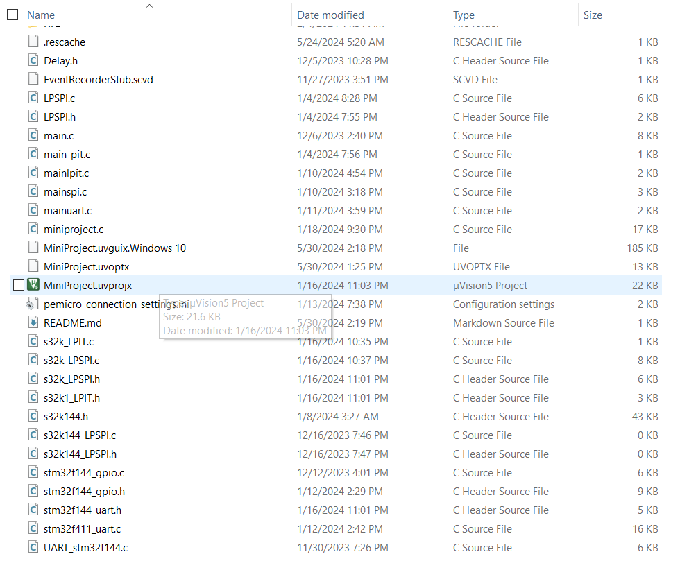
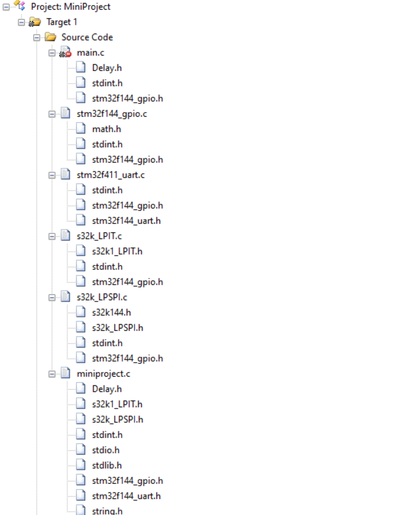
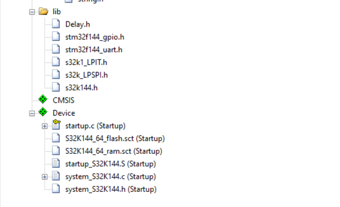

# Mock Project using Kit S32K144

## Description

Here are all the exercises I have practiced on the S32K144 kit

## Table of Contents

- [Description](#description)
- [Installation](#installation)
- [Usage](#usage)
- [Directory Structure](#directory-structure)
- [Exercise Requirements](#exercise-requirements)
  - [main.c](#mainc-exercise-requirements)
  - [miniproject.c](#miniprojectc-exercise-requirements)

## Installation

Instructions to install and set up the environment: Install keil uVision5
## Usage
Select the file MiniProject.uvprojx 

## Directory Structure

## Exercise Requirements

### main.c Exercise Requirements

#### Hardware:
- 2 buttons: BT1(PTA3), BT2(PTB8).
- 1 RGB LED (onboard).

#### Write program:
- **SRS 1:** Setting pull-down resistor, interrupt on falling-edge for buttons.
- **SRS 2:** After power on, the green LED lights up.
- **SRS 3:** Press BT1
  - **SRS 3-1:** Start LEDs lighting up periodically (Green -> Red -> Blue).
  - **SRS 3-2:** Stop LEDs lighting up periodically (LED current is bright).
- **SRS 4:** Press BT2, invert the light order of LEDs.

### miniproject.c Exercise Requirements

#### Hardware:
- 2 buttons (onboard).
- 1 USB UART CP2102.
- 8-digit seven-segment LED display.

#### Write program:
- **The Digital Clock**
- **SRS 1:** After power on, display the time: 00-00-00 (date: 01.01.1971)
- **SRS 2:** Press Button 1
  - **SRS 2-1:** Display the date.
  - **SRS 2-2:** Display the time.
- **SRS 3:** Press Button 2
  - **SRS 3-1:** Turn off the display mode.
  - **SRS 3-2:** Turn on the display mode.
- **SRS4:** Setting date, time by UART serial communication.
